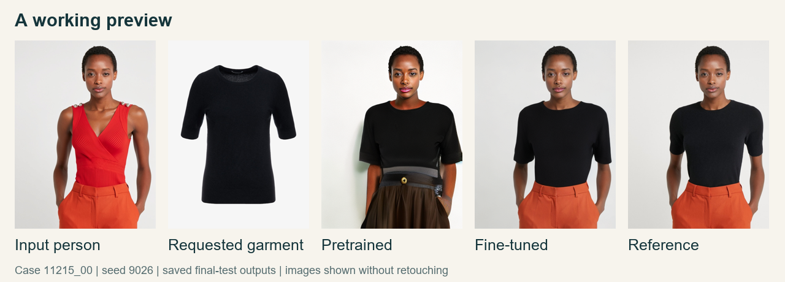

# Klara: can we trust the clothing preview?

**Anas Mhana | WBS Coding School DS#055**

Some of my first virtual try-on results looked convincing until I noticed the wrong color or clothing I had not requested. That led to one question: **does fine-tuning CatVTON-MaskFree's existing self-attention weights improve garment reconstruction while preserving the person and background?**

[Final presentation](docs/final/Klara_Final.pdf) | [Executed analysis notebook](notebooks/Klara_Final_Study.ipynb) | [Research demo](https://klara-app.de)

## A working example



The requested black shirt replaces the red top while the orange trousers remain recognizable. This is a saved test output. I selected case `11215_00`, seed `9026`, because it has the lowest fine-tuned garment error among the 11 cases that improved both garment and preservation error. It shows what worked; it does not represent every result.

## What the experiment showed

| Measure | Pretrained | Fine-tuned | Cases improved |
|---|---:|---:|---:|
| Garment MAE (lower) | 0.13355 | 0.11270 | 21 / 27 |
| Garment SSIM (higher) | 0.40831 | 0.47388 | 23 / 27 |
| Outside-clothing MAE to input (lower) | 0.04769 | 0.03534 | 13 / 27 |

Average garment error fell **15.6%**. However, **14 of 27 cases became worse outside the clothing**, even though that measure improved on average. Only 11 cases improved on both measures.


I would keep this as a research prototype. Better clothing reconstruction alone does not make a preview reliable. The presentation includes a failure where the clothing improves but the arm and trousers still change.

## Method

- **Data:** VITON-HD and VITON-HD-edit: edited person input, requested garment, original reference photograph, and evaluation masks.
- **Split:** 1,000 training cases, 64 validation cases and 32 final-test cases. These are custom splits within the original VITON-HD test partition, not an official benchmark.
- **Training:** three epochs, 3,000 updates, batch size 1, AdamW at `1e-5`. Only the existing self-attention parameters learn: **49,574,080 weights and biases in 16 modules**. The VAE and other U-Net weights stay frozen.
- **Objective:** predict the known noise added to the target-and-garment latent canvas. The final run uses ordinary noise MSE, without a regional preservation penalty.
- **Comparison:** both models use 384 x 512 images, 20 DDIM steps, guidance 2.5, eta 1.0 and seeds 9026/9027. Masks define measurement regions for MAE and SSIM; they are not inputs to the generator.
- **Analysis:** average the two seeds within each case, then compare models within that case. There were 128 attempts and 122 saved images. Six safety exclusions affected five cases, leaving 27 complete paired cases without retries.

## Repository

| Folder | Contents |
|---|---|
| [code/](code/) | Data preparation, training, generation and image analysis |
| [notebooks/](notebooks/) | One executed notebook explaining the results |
| [data/](data/) | Fixed case selections and original download/verification records |
| [evidence/](evidence/) | Training log, final-test images, references and recorded scores |
| [docs/](docs/) | Presentation PDF, README visuals and attribution |

The main path is [training_core.py](code/training/training_core.py) | [train_1000.py](code/training/train_1000.py) | [evaluate_final_1000.py](code/training/evaluate_final_1000.py) | [analyze.py](code/analyze.py). Image metrics are in [metrics.py](code/metrics.py); paired comparisons are in [paired_statistics.py](code/paired_statistics.py).

## Reproduce the results on a CPU

From the repository root, using Python 3.12 in a virtual environment:

```bash
python -m pip install -r notebooks/requirements.txt
python code/analyze.py
```

This verifies the saved image hashes and recomputes the scores and paired statistics. It does not download models, call the website or overwrite the original evidence. The notebook also checks the three complete training epochs.

All final generated images and research-resolution references are included. Original-resolution inputs can be downloaded again with the preparation scripts; source revisions and download receipts remain in `data/`.

<details>
<summary>GPU reproduction and checkpoint</summary>

The recorded run used Python 3.10, PyTorch 2.8.0+cu128 and an NVIDIA L4. In a compatible CUDA environment:

```bash
python -m pip install torch==2.8.0 torchvision==0.23.0 --index-url https://download.pytorch.org/whl/cu128
python -m pip install -r code/training/requirements.txt
python code/training/prepare_1000_data.py
python code/training/train_1000.py --preflight
python code/training/train_1000.py --output training-rerun
```

The loader verifies the fixed selection, files, source groups and recorded sample-review coverage. Investigate changed verification records rather than replacing review decisions. New runs go in ignored `runs/` folders.

The trained attention checkpoint is about 190 MiB and available separately on request. Its SHA-256 is `e4f332704879fd3929120c4c038cbb65837c8a9c694bdb9fc75bd5a18924de38`.

To regenerate the final comparison, place `attention-adapter.safetensors` in `evidence/training-1000-01/`, then run:

```bash
python code/training/prepare_final_1000_data.py
python code/training/evaluate_final_1000.py --preflight
python code/training/evaluate_final_1000.py
```

This evaluator requires the recorded checkpoint. A new checkpoint needs a separate evaluation plan. The loader builds pinned pretrained components; `apply_adapter()` then copies the saved attention weights into the U-Net.

The readable source is narrowed to the final experiment. [source-at-run.zip](evidence/source-at-run.zip) preserves the exact training, loss, evaluation and metric files whose hashes occur in the original records. Those records remain unchanged. The simplified code was checked on CPU against the original loss and recorded image scores; the GPU training run was not repeated for this cleanup.

</details>

## Limits and contribution

The data contains edited reference photographs and a limited range of people, poses and garments. Duplicate and source-group checks cannot establish identity-disjoint splits or absence of upstream training exposure. One training run, a small test and excluded outputs limit the conclusion. Pixel scores do not establish physical fit, realism or customer preference.

CatVTON's authors created the pretrained architecture and weights. My project investigates an attention-only adaptation, evaluates its trade-offs and demonstrates the checkpoint through a web app. The demo requires a running GPU server and an access code. It uses a higher resolution and 50 steps, so these research scores do not directly measure website quality.

[Data, model and code attribution](docs/ATTRIBUTION.md). Noncommercial academic research; upstream licenses and credits are retained.
