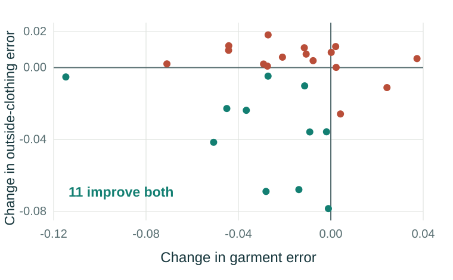

# Klara: can we trust the clothing preview?

**A data-science project by Anas Mhana, WBS Coding School DS#055.**

When I tried the clothing examples in Klara, some results looked good at first. A closer look showed the wrong color or extra clothing that I hadn't asked for. I wanted to understand whether fine-tuning the model could make the preview more faithful to the garment.

I investigated one question: **does fine-tuning CatVTON-MaskFree's existing self-attention weights improve garment reconstruction while preserving the person and background?** This project is for developers building virtual clothing previews for online shoppers.

## What I found

On the final test, average garment error fell **15.6%**, with improvement in **21 of 27 complete paired cases**. The preservation result was mixed: average outside-clothing error fell, but **14 of 27 cases became worse** on that measure. The improvement matters, but I would still want someone to inspect the preview before trusting it.

| Measure | Pretrained | Fine-tuned | Cases improved |
|---|---:|---:|---:|
| Garment MAE, lower is better | 0.13355 | 0.11270 | 21 / 27 |
| Garment SSIM, higher is better | 0.40831 | 0.47388 | 23 / 27 |
| Outside-clothing MAE to input, lower is better | 0.04769 | 0.03534 | 13 / 27 |



MAE measures pixel differences, so a lower value is better. SSIM measures structural similarity, so a higher value is better. Neither tells us whether the garment would physically fit.

I tested 32 cases with two models and two fixed random seeds, giving 128 attempts. The safety checker excluded six attempts across five cases. That left 27 cases with all four outputs available. I kept those exclusions without retrying and averaged the two seeds within each case.

## The experiment

- **Data:** VITON-HD and VITON-HD-edit. Each case has an edited person image, catalog garment, original reference photograph and evaluation masks.
- **Split:** 1,000 training cases, 64 validation cases and 32 final-test cases. This custom split reuses the original VITON-HD test partition; it is not an official benchmark result.
- **Adaptation:** 49,574,080 parameters in 16 existing self-attention modules. The VAE and other U-Net weights stayed frozen.
- **Training:** three epochs, 3,000 AdamW updates, batch size 1, learning rate 0.00001, noise-prediction MSE. The optional preservation loss had weight zero.
- **Final evaluation:** 384×512 images, 20 DDIM steps, guidance 2.5, eta 1.0, seeds 9026 and 9027. Both models used the same settings.

## Start here

1. [Final presentation](docs/final/Klara_Final.pdf) and [speaker notes](docs/final/SPEAKER_NOTES.md).
2. [Research report](docs/report/PROJECT_REPORT.md), with the full method and limitations.
3. [Executed analysis notebook](notebooks/Klara_Final_Study.ipynb).
4. [MVP presentation](docs/mvp/Klara_Mvp.pdf), focused on the question and experimental design.
5. [Code map](docs/CODE_MAP.md) and [reproduction guide](REPRODUCE.md).

After cloning or downloading the repository, open `demo/index.html` for the complete recorded gallery. It works offline. GitHub's normal file view does not run the HTML application.

The live research demo is [klara-app.de](https://klara-app.de). It needs the GPU server and an access code provided separately. The site uses the trained checkpoint at 768×1024 and 50 steps, so the controlled research scores do not directly measure website quality.

## Reproduce the analysis

Use Python 3.10 or newer in an activated virtual environment, from the repository root:

```bash
python -m pip install -r notebooks/requirements.txt
python code/analyze_final_1000.py --output evidence/final-test-1000-01 --plan data/final-evaluation-plan.json --evaluator code/training-feasibility/evaluate_final_1000.py
```

This recomputes the image metrics and paired analysis on a CPU. It makes no model, cloud or paid API calls. The notebook also checks the recorded training epochs. The large attention checkpoint is supplied separately in the course evidence bundle; its hash and loading instructions are in [CHECKPOINT.md](CHECKPOINT.md).

## Where I would be careful

These inputs are edited versions of reference photographs. They cover a limited range of people, poses and garments. I checked source IDs and exact image duplicates, but that doesn't prove that different splits contain different people, or that the pretrained model has never seen related images.

The final comparison is small and leaves out cases with incomplete outputs. That can affect the result. The final model comes from one training run, so I don't know how much a different training seed would change the outcome. The image scores cannot establish realism, correct logos, identity preservation, sizing or customer preference.

## Attribution and contribution

The CatVTON researchers created the model. This project builds on their work using PyTorch and Hugging Face Diffusers. My contribution is the fine-tuning experiment, its evaluation and the web demonstration. I directed the project, operated the environment, reviewed examples and studied how the model works.

[Sources, licenses and data attribution](docs/ATTRIBUTION.md). Noncommercial academic research. Third-party code and images retain their original terms.
